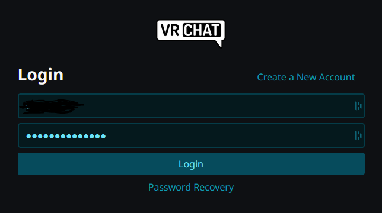
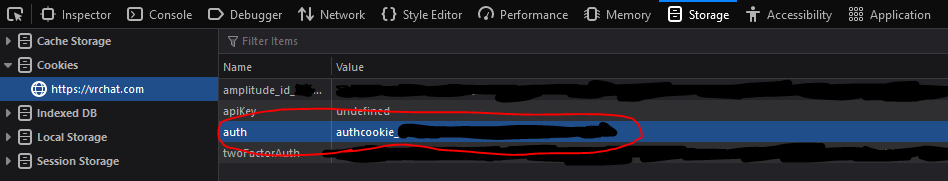

# Stream Deck VRChat Plugin

A Stream Deck plugin to keep track of your friend's statuses.

## Usage

The VRChat devs do not provide an official API (method to access their data) but there is a community driven API that this plugin uses.
To use this API you need to provide your own account's `authToken`.
To get this `authToken` you need to [login to vrchat.com](https://vrchat.com/home/login) and then use your browser's inspect menu to copy your `authToken`.

## Getting your authToken

### Step 1

Login to VRChat at [vrchat.com](https://vrchat.com/home/login): 

### Step 2

Open the developer storage menu on your respective browser.
(On most browsers you can press `Ctrl + Shift + I`)

### Step 3

Go to the tab where cookies are stored and copy VRChat's auth cookie.
It should look like `authcookie_XXXXXXXX-XXXX-XXXX-XXXX-XXXXXXXXXXXX`

#### Firefox

Firefox's cookies are in the Storage tab as show below:

#### Chrome

Chrome's cookies are in the Application tab as show below:
